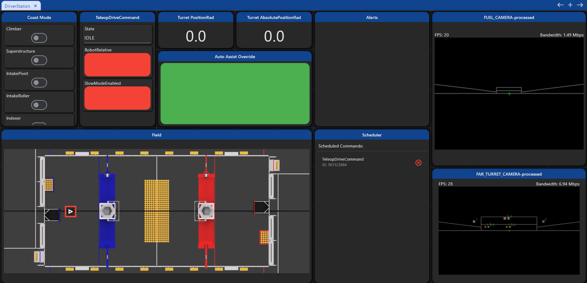
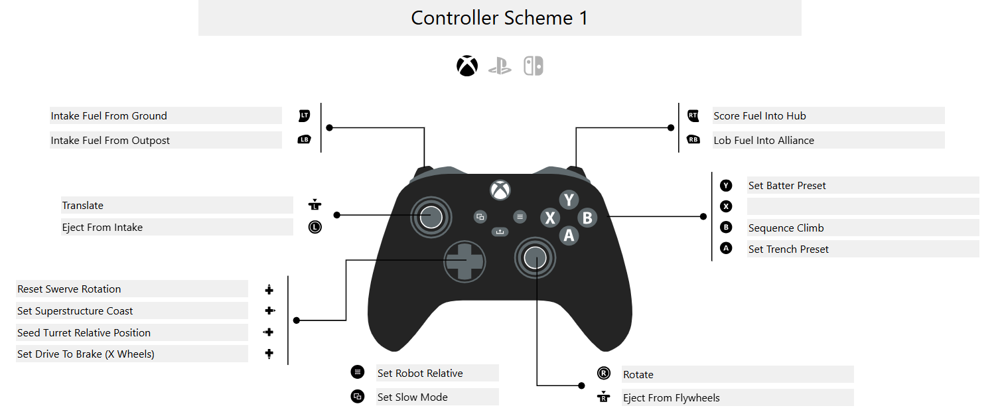

# robot-2026-rewrite

**FRC Team 503 (Frog Force) — 2026 REBUILT Robot Code**

This is a ground-up rewrite of our robot code for the 2026 FIRST Robotics game **REBUILT**. Built with Java and WPILib.

## Overview

- **Language:** Java
- **Framework:** WPILib (FRC Control System)
- **Architecture:** AdvantageKit logging + modular subsystems
- **Status:** Active development for 2026 season

## Structure

```
├── src/main/java/org/frogforce503/
│   ├── robot/                 # Main robot logic
│   │   ├── RobotContainer.java    # Central config
│   │   ├── subsystems/            # Drive, turret, flywheels, etc.
│   │   ├── commands/              # High-level commands
│   │   ├── auto/                  # Autonomous routines
│   │   └── constants/             # Field, swerve tuner constants
│   └── lib/                   # Reusable utilities
│       ├── math/              # Geometry & calculations
│       ├── subsystem/         # Base subsystem classes
│       ├── swerve/            # Swerve drive utilities
│       └── vision/            # AprilTag & object detection
├── vendordeps/                # WPILib + 3rd-party libraries
└── docs/                      # Documentation
```

## Key Features

- **Swerve Drivetrain:** CANivore + Kraken X60 motors
- **Vision:** AprilTag localization + object detection (PhotonVision)
- **Superstructure:** Turret, flywheels, hood, intake, indexer
- **Simulation:** MapleSim for physics-accurate testing

### Dashboard Layout


## Getting Started

1. Clone repo and open in VS Code
2. Run `./gradlew build` to compile
3. Deploy with WPILib extension or `./gradlew deploy`

### Controller Layout



[View interactive version on PadCrafter](https://www.padcrafter.com/?templates=Controller+Scheme+1&plat=0&leftStick=Eject+From+Intake&rightStickClick=Eject+From+Flywheels&rightStick=Rotate&leftStickClick=Translate&dpadUp=Reset+Swerve+Rotation&dpadRight=Set+Superstructure+Coast&dpadLeft=Seed+Turret+Relative+Position&dpadDown=Set+Drive+To+Brake+%28X+Wheels%29&backButton=Set+Slow+Mode&startButton=Set+Robot+Relative&yButton=Set+Batter+Preset&xButton=&aButton=Set+Trench+Preset&bButton=Sequence+Climb&leftTrigger=Intake+Fuel+From+Ground&rightTrigger=Score+Fuel+Into+Hub&leftBumper=Intake+Fuel+From+Outpost&rightBumper=Lob+Fuel+Into+Alliance&col=%23242424%2C%23606A6E%2C%23FFFFFF)

## Development Notes

- Uses **AdvantageKit** for logged-replay testing
- Modular IO pattern for hardware abstraction (sim/real/replay)
- Follow existing subsystem structure when adding features

## Disclaimer

⚠️ **This is a personal/educational rewrite and is NOT the official FRC Team 503 repository.** It is maintained separately and independently from the actual Frog Force codebase.

**Note:** Team-specific assets (CAD models, proprietary designs, etc.) are intentionally excluded from this repository to comply with FIRST guidelines and protect team intellectual property. Only code and general software architecture are published here.